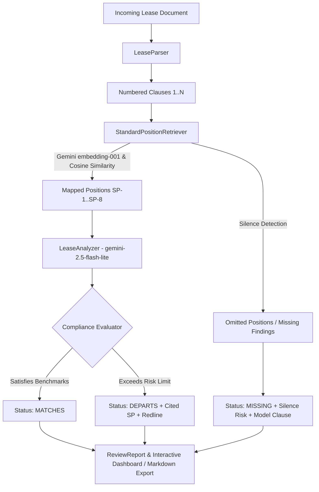

TRACK_ID=PS05

# LeaseGuard: Lease Agreement Review Assistant

An autonomous Legal Operations assistant designed for property management legal desks to audit incoming landlord lease agreements clause-by-clause against company standard positions before execution.

[](https://www.python.org/downloads/)
[](https://fastapi.tiangolo.com)
[](https://ai.google.dev/)
[](#)

---

## Demo Video

🎬 **Walkthrough Video**: [https://youtu.be/o7T9x4mK9Wc](https://youtu.be/o7T9x4mK9Wc)

---

## What the Project Does

When commercial property management firms receive lease agreements from landlords, the legal desk must carefully examine every term to safeguard operational flexibility, prevent excessive capital liabilities, and restrict unfair landlord remedies. 

Manual review is time-intensive and vulnerable to oversights—especially **contractual silence**, where an agreement completely omits critical protections like subletting rights or structural repair obligations.

**LeaseGuard** automates this review workflow:
1. **Clause Segmentation**: Intelligently parses raw lease text into structured, numbered clauses.
2. **Dense Vector Retrieval**: Uses Gemini embeddings (`gemini-embedding-001`) with cosine similarity to retrieve and cite the exact governing Standard Position (SP-1 through SP-8).
3. **Clause-by-Clause Evaluation**: Evaluates each clause with `gemini-2.5-flash-lite` under strict output constraints to determine whether it **MATCHES** or **DEPARTS** from the company position.
4. **Silence Detection (Missing Clauses)**: Detects omitted standard positions, flags contractual silence as an explicit finding, and provides standard protective model clauses for immediate insertion.
5. **No False Findings**: A clean, compliant agreement returns 100% clean; the system never manufactures findings to appear useful.
6. **One-Click Legal Desk Export**: Produces executive verdicts and exportable legal review memorandums in Markdown and JSON.

---

## Standard Positions Covered

LeaseGuard encodes 8 official company standard positions with citable IDs:

| Position ID | Category | Company Standard Position Benchmark | Acceptable Range |
| :--- | :--- | :--- | :--- |
| **SP-1** | Rent Escalation | Base rent fixed for 12 months; annual escalation capped at $\le$ 5.0% or CPI-U. No mid-term or arbitrary market resets. | $\le$ 5.0% p.a. post-month 12 |
| **SP-2** | Security Deposit | Maximum 2 months' base rent; held in segregated interest-bearing escrow; full refund within 30 days. | $\le$ 2 months; escrow; refund $\le$ 30d |
| **SP-3** | Notice Period | Mutual written notice of $\ge$ 60 days required prior to term expiration for non-renewal or modification. | Mutual notice $\ge$ 60 days |
| **SP-4** | Maintenance & Repairs | Landlord maintains structural components, roof, foundation, HVAC systems; tenant routine repairs capped at $250. | Landlord covers capital/HVAC; tenant $\le$ $250 |
| **SP-5** | Subletting & Assignment | Free assignment to affiliates; third-party sublet consent not unreasonably withheld/delayed ($\le$ 14 days). | Affiliate transfers permitted; no blanket bans |
| **SP-6** | Lock-in Period | Mandatory initial lock-in $\le$ 6 months; post-lock-in exit permitted with standard notice; no accelerated rent penalties. | Lock-in $\le$ 6 months; zero penalty exit |
| **SP-7** | Termination & Default | Minimum 30-day written cure period for monetary default; 45 days for non-monetary default. Immediate lockout prohibited. | Monetary cure $\ge$ 30d; non-monetary $\ge$ 45d |
| **SP-8** | Alterations & Improvements | Tenant permitted non-structural alterations up to $10,000 without prior consent; no mandatory bare-shell restoration. | Non-structural $\le$ $10k; no review fees |

---

## Data and Documents Generated

The repository includes realistic, domain-accurate legal materials located in the `data/` directory:

1. **`data/standard_positions.json` & `data/standard_positions.md`**:
   The authoritative company legal handbook defining SP-1 through SP-8, acceptable ranges, departure indicators, silence risks, and model replacement clauses.
2. **`data/standard_positions_embeddings.json`**:
   Precomputed and committed dense embeddings for SP-1 to SP-8, enabling instant startup ($<1$s) without startup API latency.
3. **`data/samples/sample_compliant_lease.txt`** (*Highland Tower Lease*):
   A broadly compliant commercial lease agreement adhering to all 8 standard positions. Returns **0 departures, 0 missing clauses (COMPLIANT / CLEAN)**.
4. **`data/samples/sample_departures_lease.txt`** (*Metro Plaza Triple-Net Lease*):
   A landlord-favorable commercial lease containing 8 severe departures across rent escalation (12% starting month 6), security deposit (5 months, commingled), notice (15 days for landlord vs 120 days for tenant), structural maintenance shift, blanket sublet ban, 36-month lock-in with accelerated rent, 3-day default without cure, and bare-shell restoration.
5. **`data/samples/sample_silent_lease.txt`** (*Bayview Business Center Lease*):
   A commercial office lease that completely omits **SP-5 (Subletting & Assignment)** and **SP-8 (Alterations & Improvements)**, triggering targeted silence findings.

---

## Architecture



---

## How to Run

### One Command Execution

From the repository root:

```bash
pip install -r requirements.txt
python app.py
```

The application immediately starts serving at **http://localhost:8000**.
`GET /` returns HTTP 200 and renders the single-page legal review dashboard.

### Gemini API Configuration

Set your Gemini API key:

```bash
export GEMINI_API_KEY="your-gemini-api-key"
python app.py
```

*Note: LeaseGuard automatically reads `GEMINI_API_KEY` from the environment. When the key is set, it calls `gemini-embedding-001` for embedding new text and `gemini-2.5-flash-lite` for LLM analysis. If run offline or during automated smoke testing without an API key, the built-in deterministic rule engine and precomputed vector cache execute seamlessly without errors.*

---

## Running the Test Suite

Run the comprehensive unit and integration test suite:

```bash
python -m unittest tests/test_leaseguard.py -v
```

All tests verify:
- Accurate clause parsing
- 100% clean verification for compliant agreements (zero false positives)
- Complete departure identification across all 8 terms for non-compliant agreements
- Silence detection identifying omitted terms (SP-5 and SP-8)
- FastAPI REST endpoint functionality

---

## API Reference

- `GET /`: Serves the responsive web review interface.
- `GET /health`: Returns service health and positions loaded.
- `GET /api/standard-positions`: Returns definitions for SP-1 through SP-8.
- `GET /api/samples`: Returns pre-loaded sample lease agreements.
- `POST /api/review`: Conducts clause-by-clause audit and returns JSON `ReviewReport`.
- `POST /api/report/markdown`: Generates an exportable legal memorandum in Markdown format.
